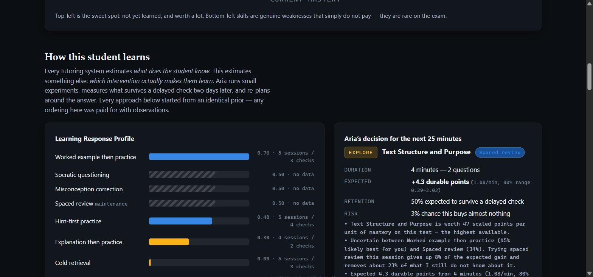
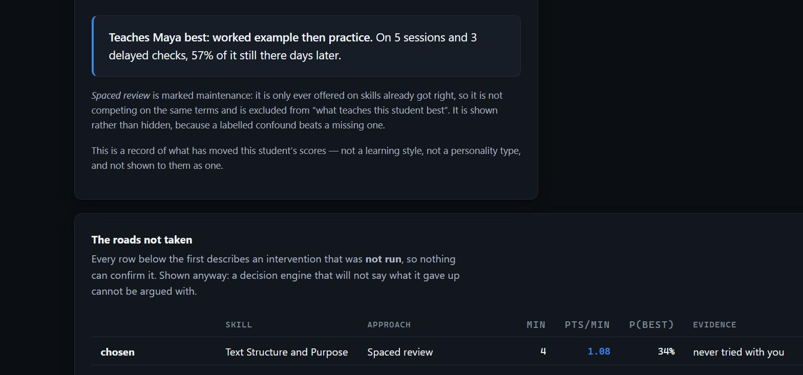
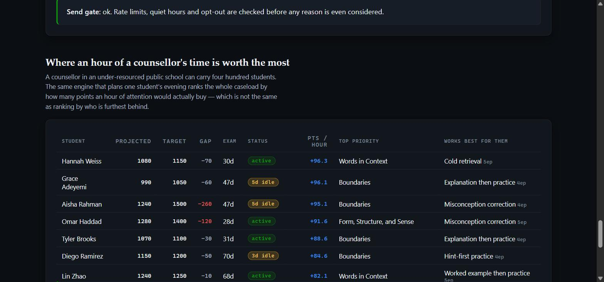

# Aria — an autonomous learning-policy agent for SAT prep

> **The short version.** Every educational AI estimates *what does the student
> know?* Aria also estimates *what actually makes this student learn?* — runs
> small experiments to find out, checks days later whether any of it stuck, and
> re-plans around the answer.
>
> ```bash
> python discover.py      # watch her work it out, ~3 minutes
> ```

---


Free SAT content is already solved. Khan Academy gives away every lesson, and
College Board gives away real practice tests. What a $200/hour tutor actually
sells is not content — it is **knowing which forty minutes to spend**. That
judgement is the part still behind a paywall, and it is the part a student
whose parents cannot buy it never gets.

Aria gives that part away. She runs on WhatsApp, on a shared phone, over 2G.

She is not a quiz bot. She maintains a probabilistic estimate of what a student
knows, simulates the exam they have not yet sat, prices every skill in
*points per minute of study*, and spends the minutes they actually have tonight
on the skills with the highest shadow price.

That is an operations research problem wearing a tutor's clothes:
**state estimation → stochastic simulation → constrained allocation.**

---

## The core claim, in one table

Here is the engine's actual output for one student — reproduce it verbatim with
`python demo.py --gains`. Skills ranked by what one minute spent on them is
worth:

| # | Skill | Mastery | Points | Min | **Points/min** |
|---|-------|--------:|-------:|----:|---------------:|
| 1 | Form, Structure, and Sense | 0.29 | 32.5 | 26 | **1.25** |
| 2 | Words in Context | 0.29 | 31.6 | 26 | **1.22** |
| 3 | Rhetorical Synthesis | 0.33 | 25.6 | 24 | **1.07** |
| 4 | Boundaries | 0.63 | 14.1 | 16 | **0.88** |
| 5 | Equivalent Expressions | **0.70** | 11.4 | 14 | **0.82** |
| 6 | Linear Functions | 0.36 | 18.1 | 24 | 0.75 |
| 7 | Command of Evidence (Textual) | **0.29** | 19.3 | 26 | **0.74** |

Look at rows 5 and 7. The student is **far weaker** at Command of Evidence
(0.29) than at Equivalent Expressions (0.70), and Command of Evidence is worth
**more raw points** (19.3 vs 11.4). Every "practice your weakest subject" app
sends them to Command of Evidence.

Aria sends them to Equivalent Expressions, because it is **cheaper to move** —
7 questions instead of 13. Fewer questions to mastery means more points per
minute. Over a fixed study budget, that ordering is worth real score.

You cannot get that ranking from a leaderboard of weaknesses. You get it from a
counterfactual: *simulate the exam with this skill raised, hold everything else
fixed, and price the difference.*

---

## The part that is not a tutor

Knowing *which* forty minutes to spend is half the problem. The other half is
what to do with them — and that answer is not the same for two students.

A worked example, a cold retrieval question, a Socratic prompt and a timed
drill are four different things to do with the same minute on the same skill.
Pedagogy research will tell you retrieval practice wins on average. Averages
are not who is holding the phone. So Aria does not follow a rule; she runs
small experiments, measures what happens, and keeps a per-student estimate of
which approach buys the most **durable** learning per minute.

```
STUDENT EVIDENCE
      |
      v
KNOWLEDGE MODEL          mastery.py     P(knows skill k)
      |
      v
LEARNING RESPONSE MODEL  policy.py      P(this approach teaches *them*)
      |
      v
COUNTERFACTUAL RANKING   counterfactual.py   price every (skill, approach,
      |                                       duration) under uncertainty
      v
TIME-CONSTRAINED CHOICE  counterfactual.plan()
      |
      v
TUTOR / WHATSAPP         tutor.py       the execution layer
      |
      v
OBSERVED OUTCOME  ---->  retention.py   and again, two days later
      |
      v
POLICY UPDATE  ------------------> back to the top
```

### The value model, in full

Every candidate action is a triple — **skill × approach × duration** — priced
as:

```
gain    = min(m x q x step(p), headroom)     mastery this would buy
durable = gain x rho                          what survives to test day
points  = durable x dScore/dMastery x eta     scaled SAT points
value   = points / minutes                    the ranking quantity
```

`m`, `rho` and `eta` are posteriors, not numbers:

| Term | What it is | Distribution |
|---|---|---|
| `m` | how much a question under this approach teaches *this* student, relative to an average question | Normal |
| `rho` | share still there at a delayed check | Beta |
| `eta` | probability they finish the block at all | Beta |
| `dScore/dMastery` | the existing simulator's counterfactual — how often the skill appears on the exam | computed |

**Minutes appear once, as the denominator.** That asymmetry is load-bearing: a
worked example spends three minutes before the first question, so it has to
earn them back. Modelling the numerator per-minute instead cancels the two and
makes every approach identical — a bug this codebase actually had, and the
reason `m` is normalised per *question* against what one average question buys
at that mastery level.

### Learning from evidence, not from a prior

Every approach starts at **exactly the same** prior. That is deliberate: if
Aria arrived believing worked examples beat explanations, a demo of her
"discovering" it would be a recital. `tests/test_policy.py` asserts it.

Evidence is pooled across skill domains but not forced to agree — three
sessions of algebra tell Aria something about how you handle grammar, weakly.
The pooled prior is built from the *other* domains only, so a domain's own
observations are never counted twice.

### Exploration, and when it stops

One Thompson draw over every candidate's posteriors gives one opinion about
what is best; a few hundred give the probability each approach *is* best. The
same mechanism produces both the interval Aria shows and the decision she
makes.

- **`EXPLOIT`** — one approach is clearly ahead, or nothing else is close
  enough to be worth an experiment.
- **`EXPLORE`** — genuinely unsure, so spend the session on whichever
  plausible option would sharpen the estimate most. An experiment must clear an
  *optimistic* value floor, not an expected one: filtering on the mean meant a
  setup-heavy approach could never be tried, and so could never earn its way to
  the top.

A brand-new student always explores. A lead inherited from Aria's own cost
model is not something she knows about them.

### Durable learning, not today's quiz score

Five right straight after an explanation proves the explanation was still on
screen. So every episode that moved mastery books **one question, two days
later**. If it comes back right, the approach that taught it earns real
evidence; if not, that approach is downgraded — not for failing to teach, but
for teaching shallowly, which is a different failure with a different fix.

This is the mechanism that catches hint-first practice: excellent immediate
performance, nothing left by Wednesday.

### Intervention regret

Each episode is chosen against a recorded forecast. Comparing forecast to
outcome is written to a log Aria can be asked about. It is **estimated policy
feedback, not causal inference** — it cannot separate a bad choice from a bad
day, and with one student nothing can.

### What a decision looks like

```
ARIA'S DECISION   [EXPLOIT]
  Skill         Equivalent Expressions
  Intervention  Worked example then practice
  Duration      9 minutes (3 questions)
  Expected      +8.4 durable points (0.93/min, 80% range 0.41-1.52)
  Retention     78% expected to survive a delayed check
  Risk          4% chance this buys almost nothing

                          skill                   pts/min  p(best)
  CHOSEN                  Equivalent Expressions      0.93     71%  Worked example
  counterfactual estimate Equivalent Expressions      0.44     11%  Cold retrieval
  counterfactual estimate Equivalent Expressions      0.31      6%  Timed drill
```

Rows below the first were not run. They are labelled as estimates because
that is what they are.

### What it looks like

Aria's estimate of how one student learns, with the evidence behind every bar.
Hatched bars are approaches she has not tried yet, still sitting on the
untouched prior:



The claim she is willing to make, and what it rests on:



And the frame that makes the argument. Look at the last column against the one
before it — **Grace, Aisha and Diego are all weakest at Boundaries, and get
three different prescriptions**, because they are three different people:



Here is the same thing in the terminal, from `python discover.py` — the same
eight approaches that started identical, after a week of simulated study:

```
  LEARNING RESPONSE PROFILE - after a week

                                  durable               evidence
  Spaced review                      1.55  ########.... 7ep / 3chk 71%   (maintenance)
  Worked example then practice       0.71  ####........ 3ep / 3chk 57%
  Hint-first practice                0.60  ###......... 4ep / 2chk 50%
  Explanation then practice          0.50  ##.......... no data
  Socratic questioning               0.50  ##.......... no data
  Misconception correction           0.50  ##.......... no data
  Cold retrieval                     0.26  #........... 3ep / 1chk 40%
  Timed drill                        0.20  #........... 3ep / 1chk 40%
```

Hint-first practice is the one to watch. It produces *good answers on the day*
and 50% retention two days later, so it ranks below worked examples despite
looking better in the moment. A system measuring only immediate performance
would keep prescribing it.

The demo ends by checking its own work:

```
  For Priya: worked example then practice.
  On the evidence of 3 sessions and 3 delayed checks.
  The hidden truth at the top of this file says worked_example.
```

`discover.py` defines a simulated student with hidden response traits. Aria
never reads them — she recovers the answer from the letters the student types.
Change the traits, rerun, and she reaches a different conclusion by the same
route.

### Students never see any of this

> "I'm still learning which practice style helps you most, so this one is
> partly a test — I'll see how much of it you still have in a couple of days."

`PROFILE` shows what Aria has noticed, and only once there are at least three
sessions behind it. No posteriors, no probabilities, and it says plainly that
it is a record of what has worked, not a personality type.

---

## How it works

```
                 answers
  student  ──────────────►  mastery.py        Bayesian Knowledge Tracing
                            (state estimate)  + forgetting curve
                                   │
                                   │  P(knows skill k) for 29 skills
                                   ▼
                            simulator.py      Monte Carlo over the exam
                                   │          ├─ project()        score distribution
                                   │          ├─ marginal_gains() shadow price / skill
                                   │          └─ plan_session()   allocation over minutes
                                   ▼
             ┌─────────────────────┴─────────────────────┐
             ▼                                           ▼
        tutor.py                                   autonomy.py
        the session, opened with a plan            should Aria speak first?
             │                                           │
             ▼                                           ▼
        bank.py  vetted questions                  outreach.py  message text
             │                                           │
             └──────────────► WhatsApp ◄─────────────────┘
```

### 1. State estimation — `mastery.py`

Bayesian Knowledge Tracing tracks `P(student has learned skill k)`, updated
after every answer through slip and guess probabilities.

Textbook BKT **never forgets**, which is wrong for test prep and — more
usefully — leaves the agent with no principled reason to message a student on
any particular day. So mastery here decays back toward the prior between
sessions, with a half-life that lengthens with each success. That buys two
things at once: the spacing effect, and `days_until_decay_below()`, which is
what lets Aria decide *when* to reach out **on her own**.

State is SQLite, local. Choosing a question is a dictionary lookup, not a
network round-trip — the student waits on their own connection and nothing else.

### 2. Simulation — `simulator.py`

The mastery model is generative, so a mastery vector can be used to *sit the
exam*. 2,000 Monte Carlo runs give a **distribution**, not a point estimate:

```
Projection(total=1130, total_low=1050, total_high=1210, rw=510, math=620)
```

Students are always shown the range. A single number would be a lie about
precision we do not have.

### 3. Allocation — `plan_session()`

Given the minutes a student actually has, allocate them across skills to
maximise expected points. Gains are **concave** — the fifth question on a skill
is worth less than the first — so this is solved by marginal allocation:
repeatedly give the next block of minutes to whichever skill currently has the
highest derivative, re-pricing after each award.

```
StudyPlan(minutes_available=40, expected_points=69.4, total_questions=20)
  Form, Structure, and Sense   7 questions   14 min   +25.7 pts   0.29 → 0.77
  Words in Context             7 questions   14 min   +25.0 pts   0.29 → 0.77
  Rhetorical Synthesis         6 questions   12 min   +18.7 pts   0.33 → 0.75
```

> This replaced a 0/1 knapsack, which was wrong twice over: it modelled each
> skill as an all-or-nothing item, and it returned an **empty plan** for any
> session under 26 minutes — exactly the short sessions a busy student has.

### 4. Autonomy — `autonomy.py`

> The difference between a chatbot and an agent is who starts the conversation,
> and whether the decision to start it was reasoned.

The old build sent every student "time to practice!" on a fixed timer — a cron
job in a tutor's costume. This version asks, per student: *is there something
worth saying right now, and what is it worth?* Every candidate is scored, the
best one wins, and **the reasoning is written to a table**.

| Trigger | Evidence |
|---|---|
| `decay_risk` | a skill they had earned is slipping below usefulness |
| `misconception_pattern` | the same specific error three times or more |
| `high_value_idle` | they have been away and points are sitting on the table |
| `test_urgency` | the exam is close and the plan is behind |
| `first_nudge` | signed up, never practised |

A student — or a judge — can ask Aria **why she messaged**, and get the actual
recorded basis, not a plausible story generated after the fact.

`python demo.py --autonomy` ages a real session by four days and prints the
entire deliberation:

```
  Central Ideas and Details    0.62 -> 0.40   <- below the 0.60 threshold
  Words in Context             0.77 -> 0.63

  WINS   17.2  decay_risk
         You learned Words in Context and it's fading. A few questions now keeps it.
         evidence: mastery 0.63, crosses 0.6 in 1.0d, worth 14 pts

          6.0  high_value_idle
         13 questions on Boundaries is worth about 34 points.
         evidence: idle 4.0d, top skill rw_boundaries at 1.33 pts/min

  Send gate: PASS - ok
```

Two candidates, scored against each other, one wins — and it is the *cheaper*
intervention that wins, not the one worth more raw points. Nothing here mocks
the clock: the demo moves the student's rows back in time, so the real decay
curve and real thresholds run unmodified.

Message text is deterministic. The LLM only warms the phrasing, and if it is
unavailable the deterministic version ships unchanged. An outage should cost
tone, never correctness.

### 5. The question bank — `bank_build.py` (offline) / `bank.py` (runtime)

Generated questions are worthless if the answer key is wrong, and a model
grading its own work is not a check — it agrees with itself.

So every item is **re-solved from scratch by a different model that never sees
the proposed key**. Two independent solves must agree with it. Any disagreement
discards the item. Rejected items stay in `bank_raw.jsonl` with the solver's
picks, so the failure rate is auditable rather than invisible.

Each distractor is tagged with the **misconception it encodes** (`sign_error`,
`combined_unlike_terms`, `contradicts_the_passage`, …), which is what lets Aria
name a mistake instead of marking it wrong, and recognise it when it recurs.

---

## Bugs found and fixed — the ones worth admitting

Written down because they are the difference between a demo and a system.

| Bug | Why it mattered |
|---|---|
| Planner returned an **empty plan** under 26 minutes | Killed exactly the short sessions the target student has |
| **Every** generated question had its answer at option A | 100% of accepted items. Fixed with a deterministic shuffle at compile time, so position is uniform by construction rather than by hoping the prompt behaves |
| Reading questions generated with **no passage** | Unanswerable, and it read fine until you tried to answer one |
| Forward projections assumed students never answer wrong and never forget | Turned a projection into a fantasy |
| RAG path returned the **same nearest neighbour forever** | Instantly visible in a demo. `bank.py` now tracks served ids per student |

Found while building the learning-policy layer:

| Bug | Why it mattered |
|---|---|
| Value modelled **per minute on both sides**, so minutes cancelled | Every intervention scored identically no matter its setup cost. The ranking was uniform and the whole layer was decorative until the observation was renormalised per question |
| Experiments filtered on **expected** value, not optimistic value | A worked example is two thirds the value of cold retrieval under the neutral prior purely because of its three-minute setup — so it could never be tried, and could never earn the evidence showing it was best. An exploration rule that only explores what it already likes is not one |
| Domain pooling **multiplied** the prior variance | A student with no history was *less* certain about a domain than about nothing at all, putting the 10th percentile of every forecast at zero. Now a between-domain effect is added and capped at the population prior |
| Episodes with **zero answered questions** were recorded as `0.00x` | Usually the bank running dry, not a failed approach — and a handful of them was enough to bury a genuinely good intervention. They are now discarded, not scored |
| Worked examples **spent a bank item nobody budgeted** | On thin skills the demonstration ate the only remaining question, producing a lecture with no practice that then recorded as "taught nothing" |
| Skill pool was cut to the top five **before** checking availability | A student who worked through their five most valuable skills was told there was nothing left to do, with twenty other skills still stocked |
| `current_question_id` survived a closed episode | The next thing typed was scored against a block the student had already left |
| Outreach rewriting **invented numbers** | An offer of ten minutes came back from the LLM as "a 2 minute question" — a figure Aria never computed, inside a message whose whole claim is that its numbers are real. Rewrites introducing unseen digits are now rejected |

---

## Honest limitations

Stated here rather than buried, because a judge who finds them unaided should
find them already acknowledged.

- **The score model approximates a non-adaptive exam.** The real digital SAT is
  module-adaptive: Module 2 difficulty depends on Module 1 performance. Aria
  models the non-adaptive approximation and converts raw→scaled through a
  published-style anchor table. It is **prep-grade, and caps around 1500** — not
  a College Board score report.
- **Projections are withheld until 8+ answers of evidence.** Below that the
  posterior is dominated by the prior and any number shown would be noise
  wearing a decimal point.
- **Student-facing copy always shows a range**, never a single number.
- **The question bank is model-generated**, not College Board licensed. The
  two-model disagreement gate raises the floor; it does not make it official
  material.

### On the learning-policy layer specifically

- **Interventions are not randomly assigned.** The engine picks them, so each
  approach is applied to the situations it was thought to suit, and the
  estimates are observational rather than experimental. Normalising against
  what an average question buys *at that mastery level* absorbs the largest
  part of this, not all of it. `spaced_review` is the clearest residual case:
  it is only offered on skills the student has already got right, and prior
  success predicts above-model performance, so it scores high for reasons that
  have nothing to do with review working. Read it as "review on half-known
  skills went well", not "review is this student's best approach". Deliberate
  exploration keeps the assignment from being purely self-confirming; that is a
  mitigation, not a fix. The real fix is randomised assignment, which costs a
  student real study minutes.
- **A delayed check is one question.** It is a noisy instrument. The Beta
  posterior carries that noise forward rather than pretending otherwise, which
  is why `PROFILE` reports session counts instead of a confident percentage.
- **Regret is policy feedback, not causal inference.** It compares a forecast
  to an outcome. It cannot tell a bad choice from a bad day.
- **Observation noise is modelled as constant when it grows with mastery.**
  Near saturation the multiplier is sharply asymmetric — one wrong answer costs
  far more mastery than one right answer gains, relative to what an average
  question buys there — so estimates taken on near-mastered skills are noisier
  and more negatively skewed than the model admits. It shows up as an approach
  scoring badly for having been used late rather than for teaching badly.
- **`discover.py`'s student is simulated**, with wider trait gaps than a real
  person's, so a mechanism is visible inside a fortnight of study rather than
  hundreds of episodes. The engine, tutor, bank and scheduler in that demo are
  the shipping ones; only the person is fictional. Narrow the gaps and Aria
  takes correspondingly longer to be sure — which is the correct behaviour, and
  is what the uncertainty column reports.
- **Only educational behaviour is modelled.** Which practice formats have
  moved this student's scores, and nothing else. No inference about attention,
  ability, or any psychological or clinical characteristic, and none of it is
  framed to the student as a trait they have.

---

## Run it

No API key and no network needed for the demo — the mastery model, simulator
and planner are pure computation over a local SQLite file.

```bash
git clone https://github.com/Eman-Yousaf/aria-sat-coach
cd aria-sat-coach
python -m venv .venv && .venv\Scripts\activate      # Windows
# source .venv/bin/activate                          # macOS / Linux
pip install -r requirements.txt

python discover.py            # Aria works out how a student learns  <-- start here
python discover.py --short    # the same run, decisions only
python demo.py                # full agent loop, scripted student
python demo.py --gains        # the table above: every skill priced per minute
python demo.py --autonomy     # skip 4 days, watch Aria decide to speak first
python demo.py --chat         # talk to Aria yourself in the terminal
python -m pytest tests/ -q    # the learning-policy suite
python dashboard.py --seed    # build a demo cohort
python dashboard.py           # write dashboard.html from the live database
python web.py                 # browser chat + coach view at :8000
```

### On WhatsApp, for real

Two transports, same engine. Both hand inbound messages to `tutor.handle()`.

**Meta's Cloud API** (`whatsapp_cloud.py`) is a webhook, so it runs wherever the
web app runs and works against a real number anyone can message. Set the four
`WHATSAPP_*` values and point Meta at `/webhook/whatsapp` — see
[DEPLOY.md](DEPLOY.md). Unconfigured, the endpoint 404s rather than sitting
open, and an unsigned request is rejected even when no app secret is set.

**whatsapp-web.js** (`main.py`, `whatsapp.py`) drives a real Chrome as a linked
device. **This is the path that needs no Meta approval** — no business
verification, no app review, no template pre-approval. Any ordinary WhatsApp
account can host it, and it is the one to use for a demo:

```bash
npm install                   # whatsapp-web.js, express, qrcode-terminal
python main.py                # spawns the bridge; scan the QR once
```

`npm install` downloads a Chromium for puppeteer. If you already have Chrome
and would rather not fetch another browser, point at it instead:

```bash
# Windows
set CHROME_PATH=C:\Program Files\Google\Chrome\Application\chrome.exe
# macOS
export CHROME_PATH="/Applications/Google Chrome.app/Contents/MacOS/Google Chrome"
```

Scan the QR with **WhatsApp → Settings → Linked devices → Link a device**. The
session is cached in `.wwebjs_auth/`, so it survives restarts and you only scan
again if you unlink or the session expires. Message the linked number from any
other phone and you are talking to `tutor.handle()` — the same code path the
web chat and `discover.py` use.

To check the bridge on its own before wiring the scheduler in:

```bash
node whatsapp-bridge.js       # prints a QR, then BRIDGE_READY once linked
```

> Because this drives a real browser and a linked handset, it runs on a machine
> you control rather than in the deployed container. That is the trade: the
> Cloud API is hostable but gated behind Meta's approval, and this is instant
> but needs a laptop that stays awake.

That needs a browser and a linked phone, so it runs on a machine you control
rather than in the deployed container. A scheduler asks `autonomy.decide()`
whether any student is worth messaging.

> Proactive outreach on the Cloud API is capped by Meta's **24-hour window**:
> free-form text is only allowed within a day of the student's last message.
> Outside it, Aria's nudges need a pre-approved template — the five that match
> `autonomy.py`'s triggers are drafted in
> [whatsapp_template.md](whatsapp_template.md).

### Talking instead of typing

Typing is a tax, and it falls hardest on the students this is for. Voice notes
on WhatsApp, and a mic button on the web page, both go through `voice.py` to a
Whisper deployment and arrive at `tutor.handle()` as ordinary text — voice is a
transport detail, not a second conversation engine.

Aria repeats back what she heard before answering. Transcription is confidently
wrong sometimes, and a student who sees "sex" for "six" needs to know why their
answer was marked wrong. Set `AZURE_DEPLOYMENT_VOICE` to switch it on; unset,
students are asked to type and nothing breaks.

### Generating questions

An API key is needed only to **generate** questions or to warm outreach
phrasing:

```bash
copy .env.example .env        # then add a key
python bank_build.py          # rebuild the bank (resumable)
python bank_build.py --report # coverage, misconceptions, answer-position balance
```

---

## Two audiences, one engine

Students get **plain text on WhatsApp** — no markdown, no emoji carrying
meaning, short messages. That is not a limitation to apologise for; it is what
survives a shared phone on a slow connection, which is the device the students
who need this most actually have. They can also **send a voice note** or **tap
a button** instead of typing, because the same constraint that makes plain text
right makes a keyboard the wrong ask.

The **web dashboard is for the counsellor**, and it exists because of a
different scarcity: one counsellor, four hundred students, one hour. Which
students does that hour move the most? That is the same allocation problem as
`plan_session()`, one level up — and the person with a desktop and a caseload
is the one who needs a screen.

---

## Files

| File | Purpose |
|---|---|
| `skills.py` | 29 College Board skills (11 R&W, 18 Math) with real digital-SAT question weights |
| `interventions.py` | The eight things Aria can *do* — each a genuinely different message sequence, with its own time cost |
| `policy.py` | The learning-response model: per-student posteriors over teaching effectiveness, retention and engagement |
| `counterfactual.py` | Prices every (skill, approach, duration) under uncertainty; Thompson sampling drives explore vs exploit |
| `retention.py` | Delayed checks — the difference between learning and performing |
| `discover.py` | The demo: a simulated student with hidden traits, and Aria finding them |
| `mastery.py` | BKT + forgetting curve over SQLite |
| `simulator.py` | Monte Carlo projection, `marginal_gains()`, `plan_session()` |
| `bank.py` | Runtime question serving; never repeats an item per student |
| `bank_build.py` | Offline generator with the two-model verification gate |
| `student.py` | Durable profiles: target score, test date, opt-out |
| `autonomy.py` | Scored outreach decisions with written-down rationale |
| `outreach.py` | Decision → message text |
| `tutor.py` | The session, opened with a plan rather than a subject menu |
| `dashboard.py` | Counsellor triage view → `dashboard.html` |
| `demo.py` | Full offline run, shadow-price table, autonomy time-skip |
| `web.py` | FastAPI front door: browser chat + `/dashboard` + the Cloud API webhook |
| `voice.py` | Speech to text, so a student can talk instead of type |
| `whatsapp_cloud.py` | Meta's official transport — a webhook, therefore hostable |
| `main.py` / `whatsapp.py` | whatsapp-web.js transport, for a machine you control |

## Deploying

The `Dockerfile` builds the hosted app and runs on Railway, Render, Fly or any
container host — it reads `$PORT`, runs as a non-root user, and keeps its
SQLite file on a writable volume at `/data`.

`requirements.txt` is the runtime set. `chromadb` and `sentence-transformers`
are deliberately absent — they serve only `sat_rag.py`, the RAG path `bank.py`
replaced, which nothing that runs imports; carrying them drags `torch` in for
roughly 2 GB that never executes. The bank generator's SDKs are separate, in
`requirements-build.txt`.

`question_bank.json` and `dashboard.html` are baked in as build artifacts.
Regenerating the bank at boot would need an LLM key, take hours, and serve
different questions on every deploy.

See [DEPLOY.md](DEPLOY.md) for the full walkthrough, including the
`DASHBOARD_TOKEN` the counsellor view requires when reached over a network.
</content>
